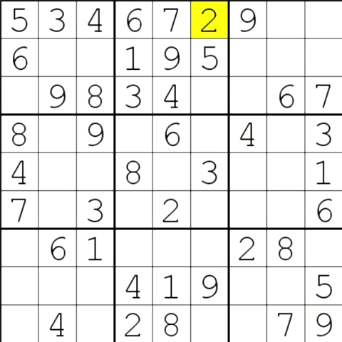

# Sudoku
Sudoku Game and Sudoku Solving Visualizer 

An app that can take any Sudoku board and will solve it using a recursive backtracking algorithm.
This is then visualized in pygame on Python 3. Furthermore, the sudoku board is completely playable and 
the user may attempt to solve it themself.

# Gif Demo

